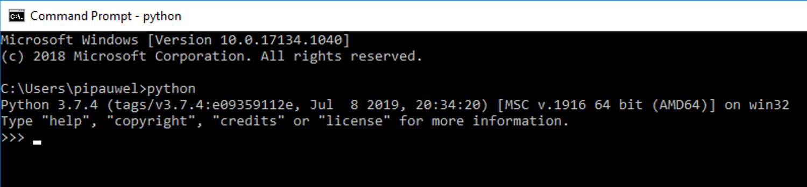
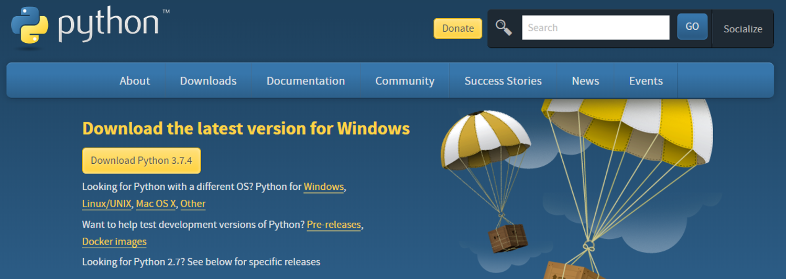
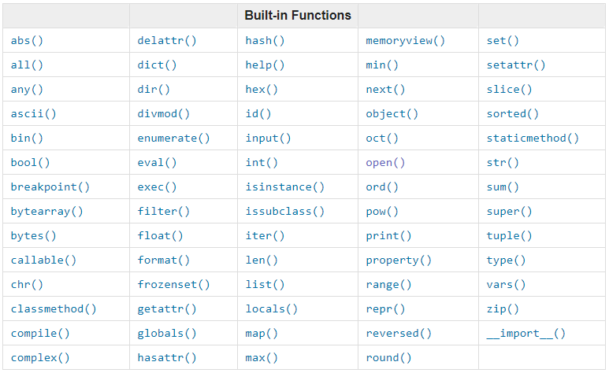
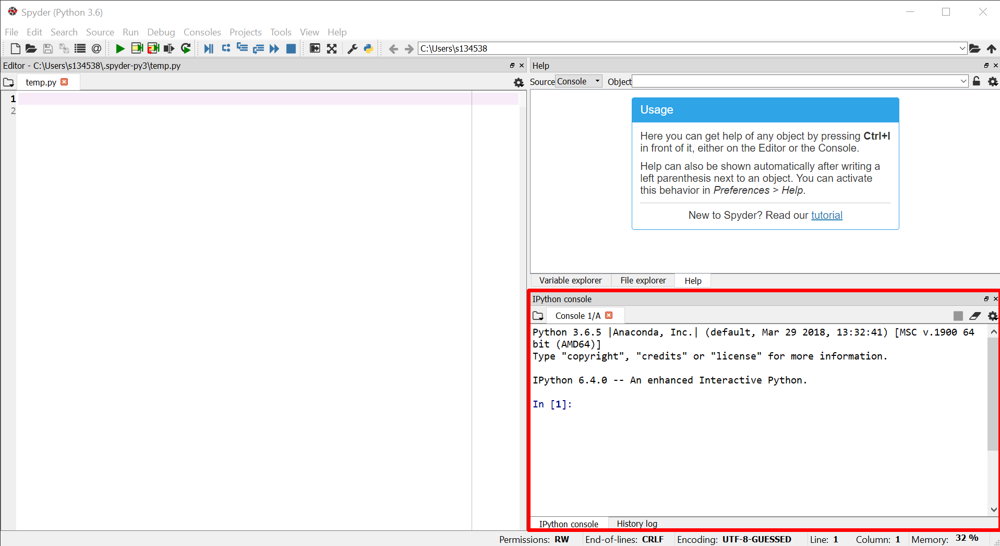
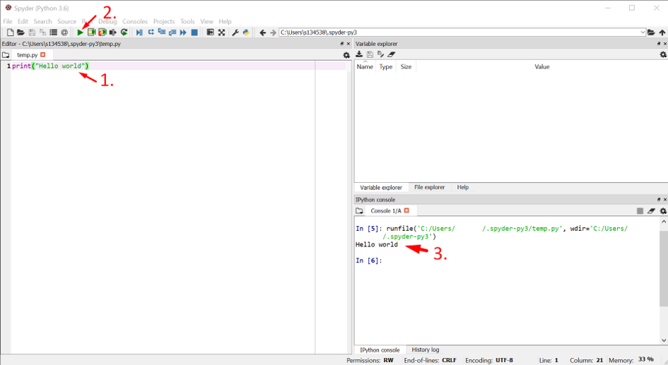
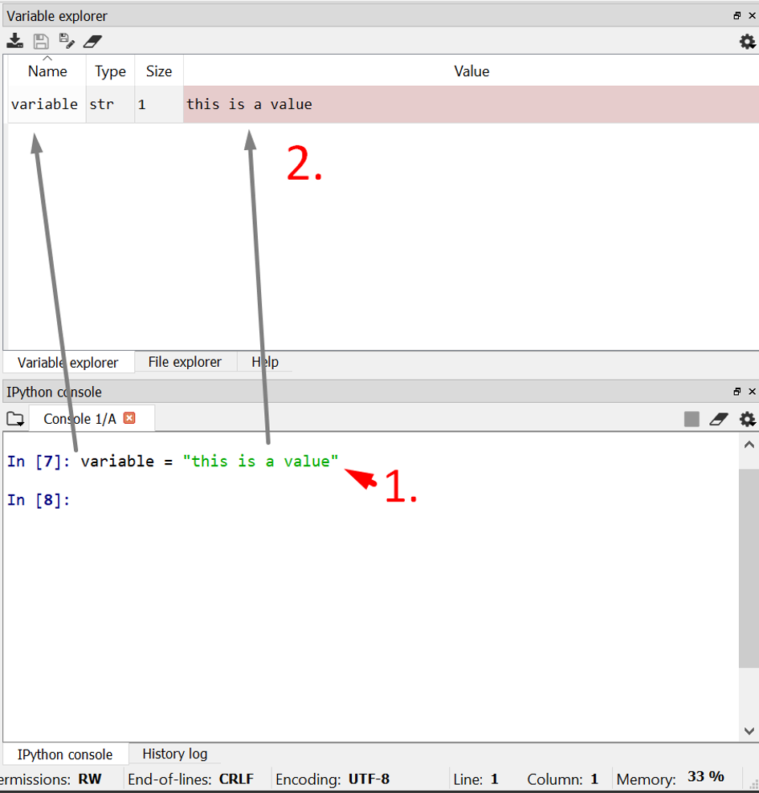
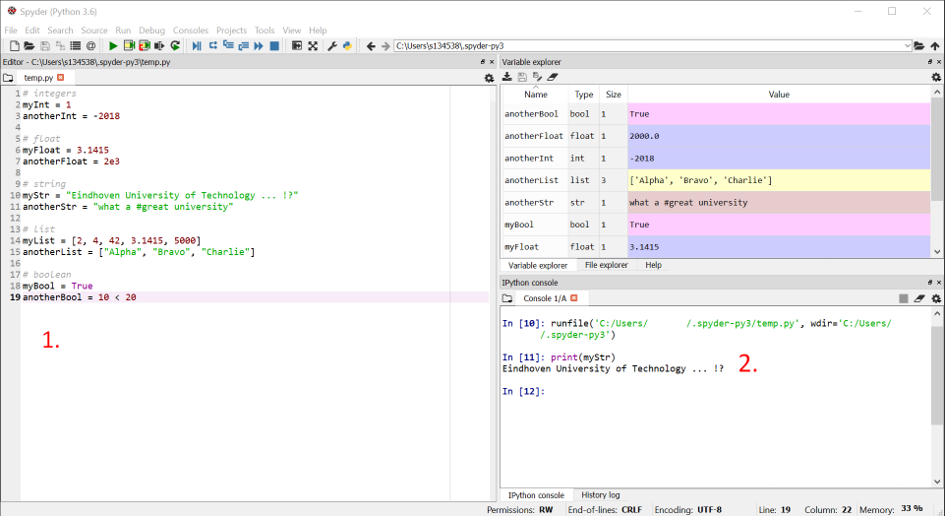

# Introduction to Python

## 1. Installation

### Check for an Existing Installation
You may already have Python installed, so check this first. Finding out whether Python is installed, can be done by:

- opening a Command Prompt on your Machine (Command Prompt in Windows; Terminal in Mac/OSX; bash shell or similar in other machines)-
- running the following command: ```python```



Make sure that you have a version of Python 3 installed (e.g. 3.7).
Note that it is possible to have a version 2 and 3 installed side by side.

If you have only a version 2 installed, or you want to upgrade your version 3 installation,
please check "Fresh Install" below.

### Fresh Install
You can install the newest version of Python from <https://www.python.org/downloads/>.
Please follow the provided instructions.

If you already have a version 3 installation, this one will be overwritten by the new version.



### Useful Commands in the Command Prompt
To install new modules, packages or Python versions, you will need to use the Command Prompt / Terminal / Bash Shell.
Although the name of this interface differes for each operating system (Windows/Linux/etc.), 
the functionality is very similar.

The *regular command prompt window* always lists the current Path in which you are. In the previous image, the path is "C:\Users\pipauwel\Python". All commands are executed at that location.

On Windows, ```dir``` provides a list of all files and folders at the current location.
For Linux based systems (e.g. OSX from Apple), the ```ls``` command is used instead.

On most operating systems, you can use the following commands to change directory:

- ```cd foldername```: moves to folder with particular foldername, located at the current location
- ```cd path/to/dir```: moves to folder specified by a path
- ```cd ..```: moves to upper directory (the folder that contains the folder you are currently at)
- ```mkdir```: creates a new folder

## 2. Executing Python from the Command Prompt

### Starting the Python Shell

You can use the Python Shell to directly execute Python code.
Although this is not the most convenient way to develop and run scripts,
it is very accesible to try out your first commands.

To start the Python shell, you can do the following:

- open a Command Prompt / Terminal / Bash Shell on your Machine
- run the command ```python```
- you will see that a ```>>>``` command line opens, which is a place where you can include and execute Python commands directly.


### Using the Python shell
In the Python shell, you can execute Python code directly. For example, you can execute the following commands:

```python
print("Hello world")
```

```python
(1+4) * 2
```

The result of the command is displayed immediately in the shell.



### Executing python scripts from a command line interface
You can also include the above Python commands in a file to execute them.
For example, you can use Notepad++ or even a simple text editor, add the command and save the file in a .py format.

- Create file hello.py with contents ```print("Hello world")```
- Execute the script from the Python command prompt:
```python
python path/to/hello.py
```

### Closing the Python shell
To stop using the ```>>>``` Python command prompt, exit python as follows:

- Windows: press Ctrl-Z and Enter
- OS X and Linux: press Ctrl-D
- Run the python command ```exit()```

## 3. Spyder

### What is Spyder?
Spyder is a so called Integrated Development Environment (IDE). In contrast to basic code editors, it provides autocompletion, debugging and testing functionality. You can use this environment to develop, improve and run your code.

You can download Spyder using Anaconda [Here](https://www.spyder-ide.org/ "Download page").

### How to use Spyder?
After the installation has finished, you can run Spyder. You will see an interface with different panels, each of which is discussed briefly below.

#### The IPython Console



In the console, you will be able to run commands like you would in the Python Shell when we used the command prompt / terminal.
For example, we can type ```print("Hello world")``` and hit enter to run this command.


#### The Editor


In the editor, you are able to write a sequence of commands and save them.
Basically, you will do the same here as we did earlier when we used a text editor to create a .py file.

When you press the small play button in the top menu, your script will be executed.
You will see the output in the console.



#### The Variable Explorer

You can use the Variable Explorer tab to get a quick overview of the variables that you have created.

- Run ```variable = "this is a value"``` to create a variable.
- You will see this variable and the value that you defined in the Variable Explorer tab.



In the next section variables are discussed in greater detail.

## 4. Features of the Language

### Variables and datatypes
A python script works with data. This data can be stored in variables with certain datatypes.

A number of datatypes are available in python:
- ```int``` - integer: integer value (no floating point)
- ```float``` - float: floating point number
- ```str``` - string: sequence of characters
- ```list``` - list: list of datatypes
- ```bool``` - boolean: binary value (```True``` or ```False```)

Values in any of these datatypes can be stored in variables. 
These variables ideally have well-defined, good, and meaningful names, so that you can understand them as a developer. 

Examples:

```python
# integers
myInt = 1
anotherInt = -2018

# float
myFloat = 3.1415
anotherFloat = 2e3

# string
myStr = "Eindhoven University of Technology ... !?"
anotherStr = "what a #great university"

# list
myList = [2, 4, 42, 3.1415, 5000]
anotherList = ["Alpha", "Bravo", "Charlie"]

# boolean
myBool = True
anotherBool = 10 < 20
```

Try it for yourself! If you add the piece of code above to a .py file in the Spyder editor and run it, you will be able to see the variables, their types and value appear in the Variable Explorer tab.
You can now use these variables later in your script. For example, you can run ```print(myStr)```.



There are some rules to defining variable names. Variable names may not contain spaces. Python will then not be able to recognize multiple words as one name. Further, variable names can not start with a number.

```python
# bad / not allowed
my name = "John Doe" #variable names can not include spaces
1like = 1prayer #variable names can not start with a number
```

To find out the datatype of a variable, run:
```python
buildingName = "VRT9"
print(buildingName)
print(type(buildingName))
```

### Comments
Comments are used to document your code inline.
This can be very helpful for others (or yourself) to understand your script and keep overview.
As you might have noticed, we actually already used comments in our previous example codes.

- ```”””``` comments multiple lines until ”””
- ```#``` comments out a single line

### Operators
Operators allow to perform operations on variables of particular data types. A number of operators are available. There are plenty of cheat sheets online that list the different available operators. If you don't know what to use to do something, Google it first; or search for a solution in the cheat sheets.


#### Number and boolean operators

(X and y are examples of variables on which the operators are performed.)

- Arithmetic
	- ```x + y```
	- ```x - y```
	- ```x * y```
	- ```x / y```
	- ```x ** y``` (notation for x^y)
- Assignment
	- ```x = y```
	- ```x += y``` (same as x = x + y)
- Comparison:
	- ```x == y``` (equal) => use ```x is y``` when x or y is a ```boolean```
	- ```x != y``` (not equal) => use ```x is not y``` when x or y is a ```boolean```
	- ```x > y``` (greater than)
	- ```x < y``` (smaller than)
	- ```x >= y``` (greater or equal than)
- Logical
	- ```x and y``` (True if both are True)
	- ```x or y``` (True if one is True)
	
#### String operators
A number of operators allows to operate with strings. Note that Python starts counting from 0. The first character in a string is thus character number 0.

- String concatenation:
	- ```"CME" + " Master!"``` => "CME Master!"
- Selecting parts of strings and handling string length
	- ```CityName = "Eindhoven"```
	- ```CityName[0]``` => 'E'
	- ```CityName[1:5]``` => 'indh'
	- ```CityName[:3]``` => 'Ein' #Everything until 3 (exclusive)
	- ```CityName[3:]``` => 'dhoven' #Everything from 3 (inclusive)
	- ```len(CityName)``` => '9'

#### List operators
Lists can contain everything:

- ```list_of_numbers = [1, 2.5, 3, 52]```
- ```list_of_strings = ["abc", "xyz", "12345"]```

Indexing is the same as for single strings: Python starts to count from 0.
- ```list_of_numbers[1]``` => 2.5
- ```list_of_numbers[-1]``` => 52
- ```list_of_strings[1]``` => "xyz"
- ```list_of_strings[1:]``` => ["xyz", "12345"]
- ```list_of_strings[2][3:]``` => "45"
	
List of numbers can be generated in multiple ways:
- ```numList = [0, 1, 2, 3]``` => [0, 1, 2, 3]
- ```numList = list(range(4))``` => [0, 1, 2, 3]
- ```numList = list(range(3,10,2))``` => [3, 5, 7, 9] #start,stop,step

Indexing can happen in steps as well
- ```myList (list(range( 10))``` => [0, 1, 2, 3, 4, 5, 6, 7, 8, 9]
- ```myList [::2]``` => [0, 2, 4, 6, 8] #[start:stop:step]
- ```myList [2:9:3]``` => [2, 5, 8]
- ```myList [::-1]``` => [9, 8, 7, 6, 5, 4, 3, 2, 1, 0]
