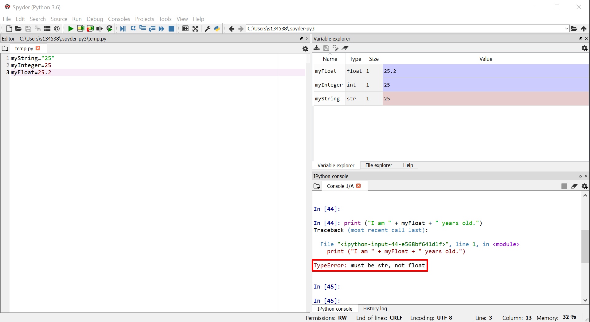
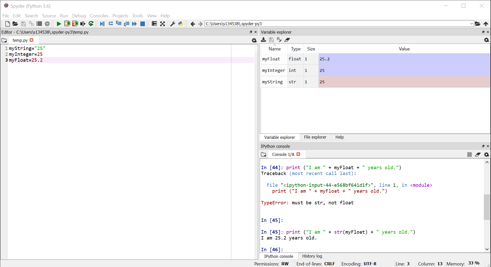
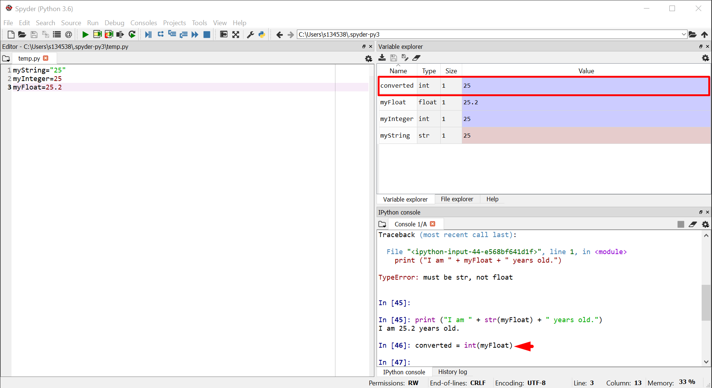
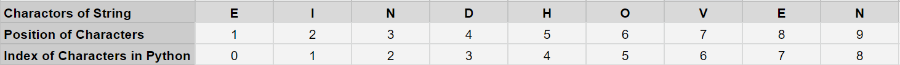
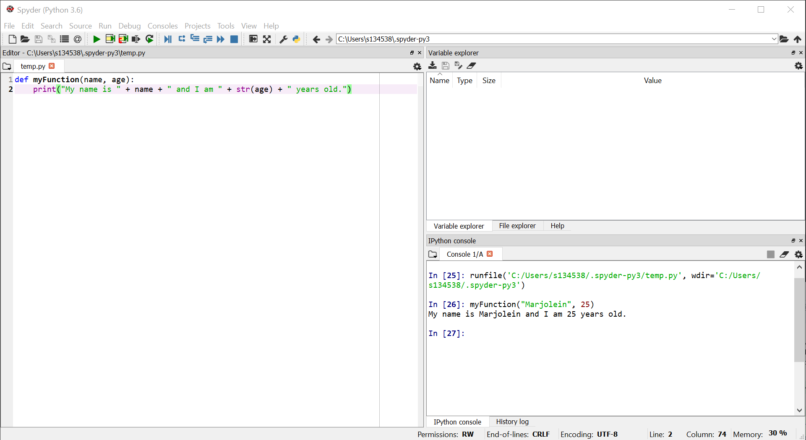
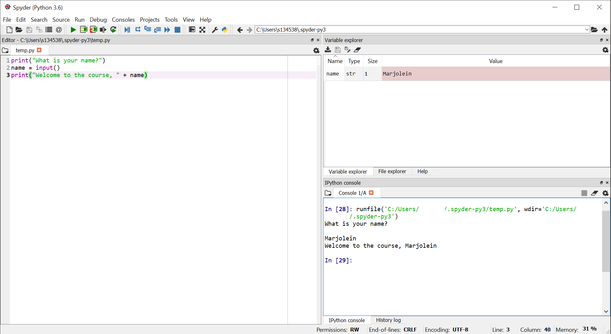

# Functions

## 1. What is a function?

Function can perform a particular operation, usually on one or several input variables. It is a block of code which is performed when the function is called. A function can return output data as a result, which you will then see appear in the console.

We can write a function ourselfs or use a standard function from Python. We can also call functions from packages / modules from third parties if we have those installed.

### Arguments

Information can be passed into functions as arguments. Arguments are specified after the function name, inside the parentheses.

For example, you can pass a string (a piece of text) as argument to the ```print()``` function as such: ```print("some text")```.

## 2. Standard Python Functions

If you followed the "Introduction to Python" tutorial (see [Here](https://pythontutorials.readthedocs.io/en/latest/01_01_GetStarted.html)), you have already encountered several standard functions. 

For example, ```print()``` can be used to print anything to the console output.

You can find an overview of other standard functions [Here](https://docs.python.org/3/library/functions.html#open).


### Functions for dataype conversions

Python supports various datatypes, such as text (string) or numbers (integers, floats). However, in some cases you are able to capture a particular piece of information with different datatypes. For example, you can store your age in full years as an integer or float, but also as a small piece of text (string). In some cases, a particular datatype migth be more readily application than another. If the input data is not of this particular type, you can use the functions below to convert the data into the most suitable one.

- ```str()```: Converts the data provided as argumenten into a string (text).
- ```int()```: Converts the data provided as argumenten into an integer (whole number).
- ```float()```: Converts the data provided as argumenten into a real number (decimal number).

Try it out for yourself following the steps below!

- Add the following piece of code to a .py file in the editor panel.

```python
myString="25"
myInteger=25
myFloat=25.2
```
- Run the code by pressing the small play button.

- Try running the following commands. You will see that not all of them work. This happens because the ```print()``` function can only take strings as an argument when you provide them in this manner.

```python
print ("I am " + myString + " years old.")
print ("I am " + myInteger + " years old.")
print ("I am " + myFloat + " years old.")
```




- To solve this, we can conver the integer and float data to string data as follows.

```python
print ("I am " + str(myInteger) + " years old.")
print ("I am " + str(myFloat) + " years old.")
```




- Alternatively, you might want to convert the decimal numbers in your dataset to whole numbers (integers). You can do this by converting the float data to integer data as shown below. When you run this, you will see that the variable "converted" of datatype "int" is added to your Variable Explorer panel in Spyder.

```python
converted = int(myFloat)
```




## 3. Writing your Own Functions

You can define your own function aswell. In this case the function will be a piece of code that you write yourself. 

To define a function, you will need to use the ```def``` keyword, followed by the name of the function, parenthesis and a colon.
Next will need to indent one level to start writing your function. You can indent using several spaces or tab. However, make sure that you always use the same indentation method throughout your script. If you this up, Python will not be able to recognize when you indent.

### A Simple Function

To illustrate, you can define a function that will print a piece of text. In the example below the function will print "My name is " followed by the name that is provided when the function is called. The provided name is in this case an argument.

- Add the following piece of code to a .py file in the editor panel.

```python
def myFunction(name):
    print("My name is " + name + ".")
```

- Run the code by pressing the small play button.

- Call the function from the console panel and provide your name as argument to the function.

```python
myFunction("Marjolein")
```
- You will see the output in the console window.

Output: My name is Marjolein.




### A Function with Mutiple Arguments

You can also create a function that takes multiple arguments by seperating them with a comma when you define the function.

- Add the following piece of code to a .py file in the editor panel.

We use ```str()``` here to change the integer argument (your age) to a string so it can be printed as text.

```python
def myFunction(name, age):
    print("My name is " + name + " and I am " + str(age) + " years old.")
```

- Run the code by pressing the small play button.

- Call the function from the console panel and provide your name as the first argument, and you age as a second one.

```python
myFunction("Marjolein", 25)
```
- You will see the output in the console window.




### Asking for Input

You can use the ```input()``` function to ask the user of your code for input. For example you can ask for someone's name and use this input to print a sentence.

- Add the following piece of code to a .py file in the editor panel.

```python
print("What is your name?")
name = input()
print("Welcome to the course, " + name)
```
- Run the code by pressing the small play button.

- You will see the question for you name appear. Provide your name as input.

- You should see the sentence appear with your name filled in.




## 4. Functions from Packages / Modules

As said before, you can also access functions developed by others from packages or modules. These can be downloaded and usually contain a large set of functions related to a particular goal. For example, NumPy is a package that containts function to perform scientific computations. You can install this package to use the functions that it offers. 

Installing and using packages or modules is out of the scope of this introductory tutorial.
However you will find more information on this in other tutorials available on the repository!


