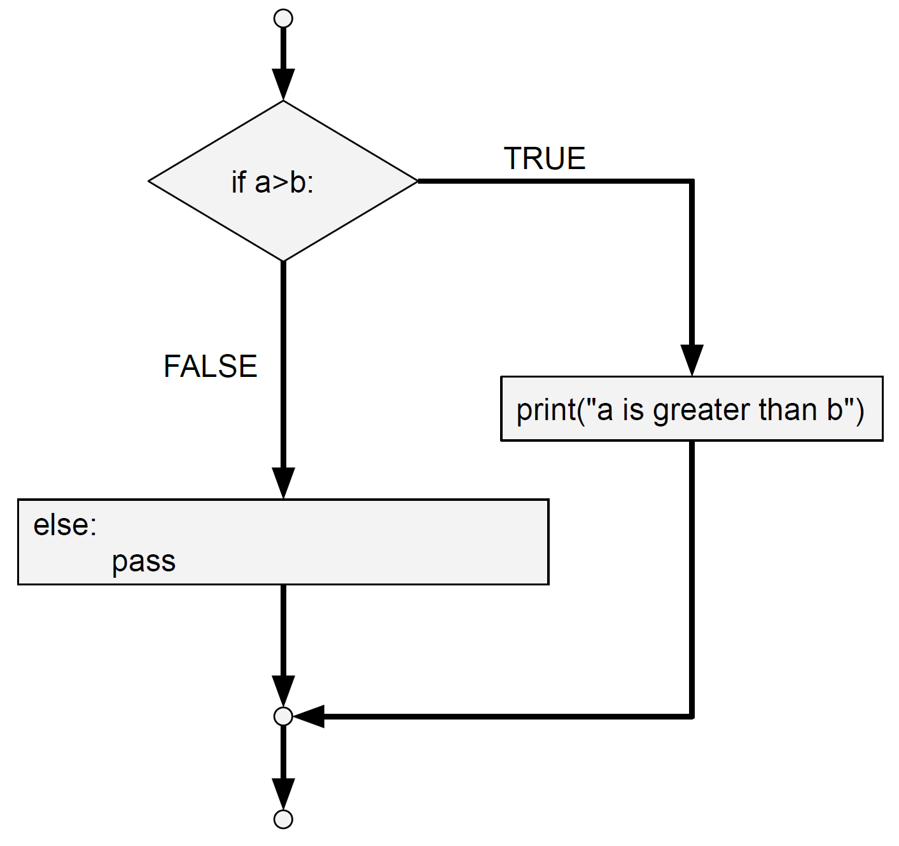

<html>
<head>
<style>
.info {
  background-color: #e6e6e6;
  border-left: 6px solid #666666;
  padding: 10px;
}
.exercise {
  background-color: #e7f3fe;
  border-left: 6px solid #2196F3;
  padding: 10px;
}
</style>
</head>
<body>

# Loops and Conditional Statements

Loops and conditional statements are very common elements of scripts. These structures allow us to specify what should happen when a particular condition is satisfied or not. 

## 1. Writing conditional statements

Python supports many of the usual logical conditions from mathematics:

- Equals: ```a == b```
- Not Equals: ```a != b```
- Less than: ```a < b```
- Less than or equal to: ```a <= b```
- Greater than: ```a > b```
- Greater than or equal to: ```a >= b```

In these examples, a and b can take different values and they can be of different datatypes. However, be aware that certain data types are not suitable for praticular logical contitions. For example, if we have a piece of text "Univeristy", which is a string, it will be impossible to evaluate if this is greater than another value. Although this may seem obvious in this example, it could be possible that you stored two numbers (e.g 2 & 4), but you stored one of them as a string instead of an integer. In this case, you will also receive an error. Please see [here](01_02_LanguageFeatures.md) for more on datatypes such as strings and integers.

****
### Exercise 1: Understanding Conditional Statements
<div class="exercise"><strong>Below are some exercises to help you understand conditional statements in Python. Although they may seem simple, please make sure you fully understand how to apply these statements, because you will need this knowledge in the following steps.</strong><br/><br/>
    <ol>
        <li>Start by specifying two variables: x=5, y=10, z=10 at the start of your script.</li>
        <li>What happens if you now run "x == y" in the console?</li>
        <li>What datatype is the output that you get? If you are not sure, store the output to a variable (e.g. var) by running "var= x==y" and run "type(var)".</li>
        <li>Write a conditional statement to confirm that x is not equal to y.</li>
		<li>What happens if you run "y < z" and "y <= z" ? Explain why the results are different.</li>
    </ol> 
</div>

****

## 2. If statement
If statement allow you to check whether a particular statement is true or not. Depending on the boolean evaluation (true versus false), a particular piece of code (or nothing) is executed. 

The header line of the if statement begins with the keyword ```if``` followed by a boolean expression and ends with a colon (:). The indented statements that follow are called a block. This block contains the code that should be executed when the condition is satisfied. Each statement inside the block must have the same indentation. The first unindented statement marks the end of the block. 

```python
if <conditional statement>:
	<code to be executed when conditional statement is TRUE>
```

If you would like to specify what happens when the conditional statement is not true, you can use a ```if else```. 

```python
if <conditional statement>:
	<code to be executed when conditional statement is TRUE>
else:
	<code to be executed when conditional statement is FALSE>
```

We can also chain conditional statements to be checked using a ```if elif else``` structure as shown below.

```python
if <first conditional statement>:
	<code to be executed when first conditional statement is TRUE>
elif <second conditional statement>:
	<code to be executed when second conditional statement is TRUE>
elif <third conditional statement>:
	<code to be executed when third conditional statement is TRUE>

...

else:
	<code to be executed when all conditional statements above are FALSE>
```

In the case that you do not want to execute any code in a particular situation, you can use ```pass```.

**Important things to keep in mind when writing if statements:**
* Be aware of the indentation. That is, the code that must be executed is indented by one level. Click [here](06_Help.md) to learn more about identation.
* Do not forget the colon (:), it seperates the header of the statement from its body.
* Several forms of if statements are possible, as shown below. They differ in the amount of conditions that are checked. 

Below you can find several examples of if statements.

### 2.1 One condition

The most basic form of an if statement checks one condition. If this condition is true, the code below it will be executed. If the condition is not true, it will always perform the second piece of code.

*If this is true, do that. Otherwise, do this.*

```python
a = 12
b = 5
if a > b:
	print("a is greater than b")
else:
	print("a is not greater than b")
```


### 2.2 One condition, pass

As adressed above, we can use ```pass``` to specify that we do not want any code to be executed in a particular situation. In the example below, this is the case when the if statement (a > b) is not true.

*If this is true, do that. Otherwise, do nothing.*

```python
a = 12
b = 5
if a > b:
	print("a is greater than b")
else:
	pass
```


****
### Exercise 2: Writing an IF Statement with one Condition
<div class="exercise"><strong>In this exercise, you will develop a simple IF-statement yourself. Imagine you are writing a very basic program to control the heating in your room. You want to heater to turn on only when the temperature is below 18 degrees celsius. Assume the program will run every time the temperature is measured.</strong><br/><br/>
    <ol>
        <li>How many conditions will you need to specify?</li>
        <li>First, create a variable that stores the temperature threshold value.</li>
        <li>Next, create a variable that stores the value of the actual room temperature. You can chose any value to represent the hypothetical current temperature.</li>
        <li>Formulate a statement that captures the rule (*when the actual temperature is below the threshold*).</li>
        <li>Formulate what should happen if the condition is satisfied. As means of simulation, print "heating" when the heater is turned on.</li>
		<li>What did you use to specify that nothing should happen if the condition is not satisfied?</li>
		<li>Test your program for several different actual room temperature values. Does it behave as expected?</li>
		<li>You would like to tell from the output of your program if the heater is not turned on (instead of simply not getting any output). How can you do this?Try to implement this and test your program again.</li>
    </ol> 
</div>

****

### 2.3 Multiple conditions

As mentioned before, we can chain multiple statements using a ```if elif else``` structure. In this way we can capture all situations where the program should perform specific behavior.

*If this is true, do that. Else check if this is true, and do that. Else do this.*

```python
a = 3
b = 5
if a > b:
	print("a is greater than b")
elif a == b:
	print("a is equal to b")
else:
	print("b is greater than a")
```


****
### Exercise 3: Writing a an IF Statement with Two Conditions
<div class="exercise"><strong>Recall the situation described in Exercise 1. Now imagine you also have an airconditioner. If the temperature is below 18, you still want the heater to turn on. Additionally, you want the airconditioner to activaten whenever the temperature is above 25 degrees. If the temperature is between 18 and 25 degrees, you want both systems to be turned off. Again, simulate what happens by printing it.</strong><br/><br/>
    <ol>
        <li>How many conditions will you need to specify?</li>
        <li>First, create the variables that store the actual temperature value and the threshold values.</li>
        <li>Formulate all conditional statements that are applicable to the situation.</li>
        <li>For each of the conditions, print what should happen in terms of the activation of either the heating or airco systems.</li>
		<li>Test your program for several different actual room temperature values. Does it behave as expected?</li>
    </ol> 
</div>

****

## 3. While-loop
In a While-loop, a certain script is performed as long as a particular boolean statement evaluates to True.

*While this is true, do*

```python
i = 1
while i < 10:
	print(i)
	i += 1 #i = i + 1
```

A while-loop can be interrupted or loops in a while-loop can be skipped using the ```break``` and ```continue``` statements.

```python
i = 1
while i < 10:
	print(i)
	if i == 5:
		break
	i += 1

i = 1
while i < 10:
	print(i)
	if i == 5:
		continue
	i += 1
```

## 4. For-loop
*For every element in this entire sequence, do*

```python
cars = ["Volvo", "Ford", "Mercedes"]
for carName in cars
	print(carName)
		
city = "Eindhoven"
for letter in city
	print(letter)
```


