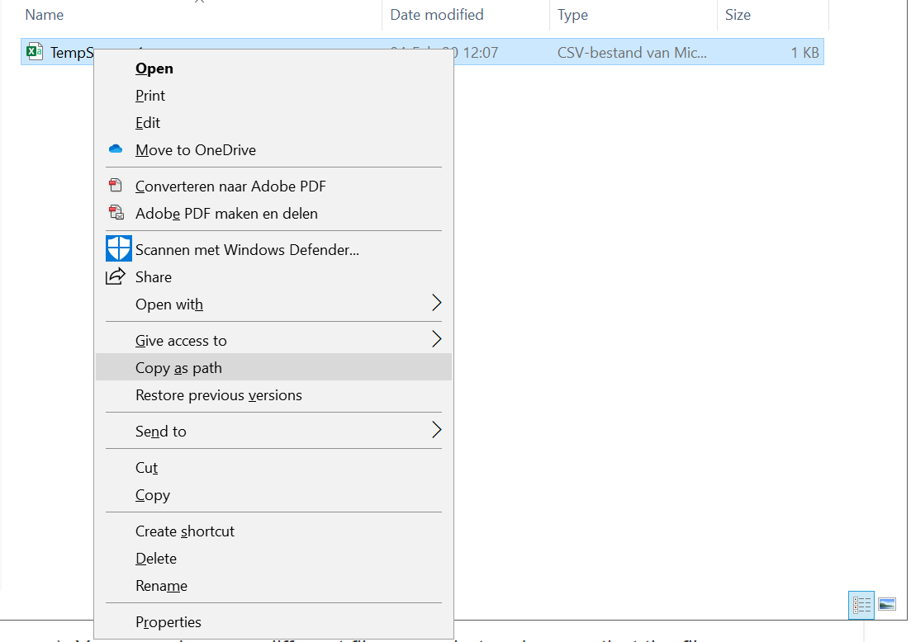

# Working with CSV files

## In this tutorial

In this tutorial we will discuss how you can use Python to work with CSV files. We we show how to read the data from these files, perform edits or store our results to them. To do so, we will use [Pandas](https://pandas.pydata.org/pandas-docs/version/0.15/tutorials.html). 

## What is a CSV file

You might have worked with CSV files before, but it is important to realize how these files are build up. If you open a CSV file in Excel, you might not really notice a difference to .xls files. However, CSV files are unique in the sense that they are accesibile to almost any software package out there. The reason for this is that the file structure is very simple. If you open a CSV file in a simple text editor (e.g. notepad), you will notice that they consists of lines of information which is seperated by comma's, hence the name "Comma Seperated Values". Each line represents a data point and the values on that line is the information that we have on each case.


## Reading a CSV file

First things first, you will need a csv file to read. You can download a practice file [here](../../files/TempSensor_1.csv). This file contains some hypothetical data from a temperature sensor.

### 1. Find the path

Next, you will need to find out the path to the location where you stored the file. 

- Right click the .csv file while holding the shift key on your keyboard down.
- Chose "Copy as path" from the menu that appears.



- If you now paste the path you just copied into a text editor, you should see something as is shown below. This is the location that the .csv file is stored at on your harddrive.


### 2. Import the csv file

Now that we know where the .csv file is stored we can read it using pandas. Since pandas is a [module](01_05_Modules.md), we will first need to import it at the beginning of our script.

- Import the pandas module at the start of your script.

```python
import pandas as pd
```

