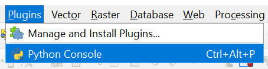

# Modules and Packages

<html>
<head>
<style>
.info {
  background-color: #e6e6e6;
  border-left: 6px solid #666666;
  padding: 10px;
}
.exercise {
  background-color: #e7f3fe;
  border-left: 6px solid #2196F3;
  padding: 10px;
}
</style>
</head>
<body>

## 1. Modules & Packages

In [this](01_04_Functions.md) tutorial we discussed the basics of using and defining functions. The functions that we used so far were build-in functions of Python. We combined these functions to create our own custom predefined sequences of coding that we can call whenever we need them.

In some cases, individuals or groups of people develop functions that are very useful to others. By collecting the definitions of these functions in one ```.py``` file, they can easily be shared. This file is then called a **module**. A **package** is a way of structuring multiple multiple modules. 

To use the definitions of functions in a module or package, you will need to download or install it and **import** it in your own script. Below we will discuss how to do this and where to find useful modules / packages.

## 2. Installing Packages Using Pip

As an illustration, we will show you here how to install and import the package ```GetOldTweets3```. This package allows you to download Twitter data easily so you can analyse it using Python.

To make things a little easier for us, we will use ```pip```, a package manager for Python. If you are running Python 3, ```pip``` should have come installed with it. You can check this by running ```pip --version``` in your console. If, for some reason, ```pip``` is not installed, you can find the instructions to do so [here](https://pip.pypa.io/en/stable/installing/).

You can find all packages available for (automated) installation with ```pip``` on there website. As you can see [here](https://pypi.org/project/GetOldTweets3/), the page of each package also shows the code you can run to install the package. In the case of GetOldTweets3 this is ```pip install GetOldTweets3```. If you run this code from your console, pip will take care of the rest.



****
### Exercise 1: Installing the GetOldTweets3 Package Using Pip
<div class="exercise">Try to install GetOldTweets3 using pip as described above. We will use this package in further examples.
</div>
<br>

****

## 3. Using Packages

Since Python runs the lines of code sequentially, the import must happen before the functions of the module can be called. Hence, it is common to place the lines of code for importing modules at the top of a script as shown below.

```python
Import GetOldTweets3
```

You will usually find instructions on how to access the functions of a package in the documentation. For example, if we look at [the Github page of GetOldTweets3](https://github.com/Mottl/GetOldTweets3), we can see com examples at the very end of the page.

We will use two functions of this package in our example. 
- ```TweetCriteria()``` to define our search criteria.
- ```getTweets()``` to collect the tweets according to our define search criteria.

Since GetOldTweets3 is a package, consisting of multiple modules, we need to know where to find these functions in the structure. We move through the structure using points ```.``` to seperate the name of the package, the categories and the module names.
- Since the functions for defining the search criteria are found under ```TweetCriteria()```, which is categorized under ```manager```, we can access them as follows ```GetOldTweets3.manager.manager.TweetCriteria()```.
- Since ```TweetCriteria()``` is categorized under ```manager.TweetManager```, we will have to use ```GetOldTweets3.manager.TweetManager.getTweets()```.

To illustrate the above, an example is provided below.

```python
# Importing the package.
Import GetOldTweets3

# Defining the search criteria.
tweetCriteria = got.manager.TweetCriteria().setQuerySearch('Eindhoven')
                                           .setSince("2019-05-01")
                                           .setUntil("2019-09-30")
                                           .setMaxTweets(1)

# Collecting one tweet based on the search criteria and store it to the variable "tweet".
tweet = got.manager.TweetManager.getTweets(tweetCriteria)[0]

# Print the text of the collected tweet.
print(tweet.text)
```

It might be that you need to access a function from one package mutiple times. If the package name is quite long, this means that you have to repeat that long name several times. This may make your code less readable and could even slow you down in writing your code. To overcome this issue, we can use ```import x as y```, where x is the actual name of the package and y is the abbreviation you would like to use.

****
### Exercise 2: Collecting a Tweet using GetOldTweets3
<div class="exercise">
    <ol>
        <li>Do you know what datatype the variable "tweet" is in the example above?</li>
        <li>Adapt the search criteria in the example above to collect one tweet on a topic of your choice, posted in the year 2017 </li>
        <li>Print the text of the tweet you just collected. (See the example code.)</li>
        <li>Use the "import x as y" structure to import GetOldTweets3 as GOT3. Test if the code of the previous two exercises still works properly.</li>
        <li>Try to print the hashtags of the tweet that you just collected. If your tweet does not appear to have any hashtags, adapt your search criteria until you find one that does. (Hint, look under "Python classes" on <a href="https://www.anaconda.com/distribution/">this</a>) github page.</li>
        <li><strong>Advanced:</strong> Write a loop to collect multiple tweets (e.g. 10). Add a counter to keep track of how many tweets you collected. For each tweet that you have collected, print one line with first the index of the tweet (based on the counter), then the content and finish the line with the hashtags.</li>
    </ol> 
</div>
<br>

****

## 4. Finding Packages

There is a huge supply of free modules and packages available for you to download. Almost anything you would want to do using Python can be done in multiple ways. Therefore it is recommended to simply start a Google search and try out some different options. Play around with what is available and see what fits your project best.

To help you get started, you can find a list below of very common and useful packages. We discuss some of these packages in greater detail in other tutorials.

- **[NumPy](https://numpy.org/):**  NumPy is a fundamental library for working with numerical data. It can work with special array objects (called numpy array), which is a grid of indexed values (much like a dataset in SPSS). You can perform mathematical operations on these arrays, like summing over a particular colomn.
- **[pandas](https://pandas.pydata.org/):** Pandas provides a huge set of tools for data analysis and manipulation. You can use it to perform descriptive analyses (e.g. summary statistics), but also to develop plots (e.g. bar charts or boxplots). Some specific extensions are available such as **[GeoPandas](https://geopandas.org/)**, which is specifically developed to work with GIS data.
- **[Matplotlib](https://matplotlib.org/):** If you are specifically interested in visualization, including animated and interactive images, the Matplotlib library might the interesting to have a look at.
- **[Keras](https://github.com/keras-team/keras):** Keras is a well known library for machine learning. You can use this package if you want to work with neural networks.
- **[Scrapy](https://scrapy.org/):** If you are looking to collect data from the internet, you could consider Scrapy. This package allows you to "scrape" data from websites.

<div class="info">
  <strong>Note: </strong>If you are using the Anaconda Python distribution (<a href="https://www.anaconda.com/distribution/">see here</a>), you will find some of these packages installed already.
</div>
<br>


