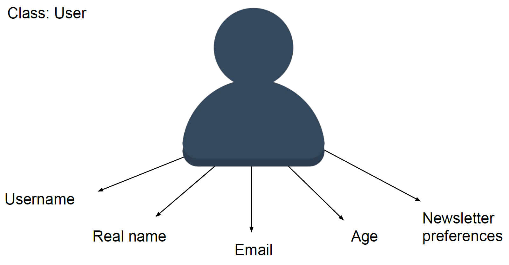
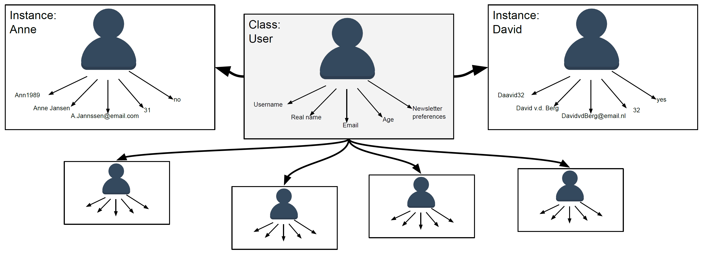
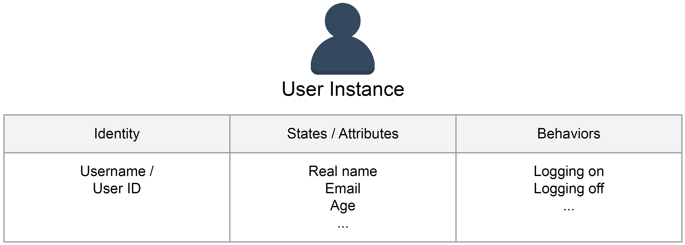

<html>
<head>
<style>
.info {
  background-color: #e6e6e6;
  border-left: 6px solid #666666;
  padding: 10px;
}
.exercise {
  background-color: #e7f3fe;
  border-left: 6px solid #2196F3;
  padding: 10px;
}
</style>
</head>
<body>

# Classes, Objects and Instances

## 1. Object Oriented Programming
Python is a so called **"object oriented"** programming language. Throughout the previous tutorials in this sequence, you have already encountered numerous objects. Whenever we defined a variable, for example a string variable that stored your name, we were creating objects. These objects contain data, which can concern both properties (like your age, a list of names of people that take a course, etc.) or procedures (like a function). 

## 2. Classes
Classes can be understood as blueprints or templates for objects. They define a structure for storing the data related to a particular type of objects. 

Consinder for example a situation where you want to keep a record of the users of a program. For each user, we will need to store a number of properties, such as their username, email adress, password, etc. Since these properties will be the same for every user, we can efficiently use a class to predefine what should and can be stored regarding each user. 




****
### Exercise 1: When to use a class?
<div class="exercise"><strong>Consider the above. Could you come up with another situation where using a class could be useful?</strong><br/><br/>

* What does the class apply to? Students, dogs, doors? That is, what are you defining a blueprint for?
* Write down a couple of properties that relate to the class that you came up with.
* Also, write down in what datatype each property should or can be stored.

</div>
<br/>

****

## 3. Class Objects / Instances
When we create an object based on a class, we "copy" the datastructure defined by the class (the blueprint) and fill in the actual values that are applicable. The object that is created is called an **instance** of the class. The class functions as a guide for knowing which information can and should be stored for each instance.

Going back to our example regarding the users of a program, each user would be an instance of the class. For each user we copy the blueprint of the information we need to store and we fill in the values for each individual.

Creating an object of an class is called **"initiating the class"**. There is no limit to the amount of instance that can be created. All instances have in common the attributes that are stored and the bahavior related to the class. 



****
### Exercise 2: What is an instance?
<div class="exercise"><strong>Go back to your earlier idea for developing a class.</strong><br/><br/>

* What would be an example of an instance of your class?
* For two instances, fill in the values of the properties (conceptually).

</div>
<br/>

****

**Class objects consist of:**
1. **An identity**, which refers to the unique name of the object. Remember, each instance of a class is a unique, individual object that we can specifically refer to in our code.
2. **A states**, which is captured by the defined properties. For example, the username and age of a user describe the state of the instance.
3. **The bahaviors**, which are captured in specific functions (methods) that relate to the class. You will find some examples in later sections.




****
### Exercise 3: Identity, States and Behaviors
<div class="exercise"><strong>Go back to your earlier idea for developing a class.</strong><br/><br/>

* How are the instances identified?
* What are states of your instances?
* Come up with at least two relevant behaviors. (Are you having trouble with this? You can also return to this question when you have read the part on methods.)

</div>
<br/>

****

## 4. Creating a Class in Python

Declaring an object or initiating a class refers to creating an instance of a class. To do this, we first need to define the class. This is done using the ```class``` keyword, follow by a colon. We then indent the next line and start defining attributes and methods (functions that capture the behaviors).

```python
class User:
    ...
```

### 4.1 Specifying Class Attributes (States)

Class attributes concern those properties that are shared among all instances. In our example of the ```User``` class, this could be the case for the property ```userType```. Assuming that all instances of the ```User``` class concern normal users (and not, for example, admins), we can create the ```userType``` as shown below. This attribute is copied for all instances of this class.

```python
# Specify the class "User"
class User:
    # Defining class attributes:
    Usertype = "Normal User"
```

### 4.2 Specifying Instance Attributes (States)

In contrast to class attributes, instance attributes are unique properties of class instances. Their values are not copied from the blueprint, but specified upon the creation of the instance. 

In our example of the ```User``` class, instance attributes concern the real name of the user, age, email and anything else that is user-specific. 

These inistance specific properties can be specified using the ```__init__()``` function. This function assigns values to instance properties upon initiation of a class. That is, whenever you create a new instance, this function will run automatically.

As you can see below, ```__init__()``` in our example takes as first argument ```self```. This refers to the instance at hand. In our case, this is a specific user. As we will see later, we do not have to provide a value for this argument when we create an instance. The reason for this is that Python will provide it for us. 

We can assign values to properties in the ```__init__()``` function of a class by typing ```self.``` (referring to the instance that is being created) followed by the name of the property. Then, we assign a value using ```=```. In the example below, we did so for the real name, age and email of a user instance.

```python
# Specify the class "User"
class User:
    # Defining class attributes:
    Usertype = "Normal User"

    # Using __init__() to assign values to instance attributes:
    def __init__(self, name, age, email):
        self.realName = name
        self.age = age
        self.email = email
```

### 4.3 Specifying Methods for a Class (Behaviors)

A **method** is very similar to a function, but it is associated with a specific class. Just like functions, we specify methods with the ```def``` keyword, followed by the name of the function, possible arguments between brackets and a colon. Do not forget to indent the line of code that follows!

<div class="info">

**NOTE:**
Are you not sure what **indentation** is and why it is so important in Python? Please check out the section on "Indentation" on the [help page](06_Help.md). You will find everything you need to know about indentation there!

</div>
<br/>

<div class="info">

**NOTE:**
Do you want to have another look at how you can call and formulate functions? Click [here](01_04_Functions.md) to go back to the tutorial on functions.

</div>
<br/>

To illustrate, lets return to our previous example. We will add a method to the ```User``` class which simulates a message stating the user has logged on (by printing the message to the console).


```python
# Specify the class "User"
class User:
    # Defining class attributes:
    Usertype = "Normal User"

    # Using __init__() to assign values to instance attributes:
    def __init__(self, name, age, email):
        self.realName = name
        self.age = age
        self.email = email

    # Defining methods:
    def logon(self):
        print(self.RealName + " has logged on.")
```

****
### Exercise 4: Specifying a Class in Python
<div class="exercise"><strong>Again, continue with your earlier idea for developing a class. You will now try to specify this class in Python.</strong><br/><br/>

* Start by using the ```class``` keyword and chose a name for the class.
* Next, formulate several attributes. Include both class and instance attributes.
* Pick a behavior you could capture in a method. (Similar to the earlier example, this can be a simulation by printing a sentence.)
* Add this method to the class.

</div>
<br/>

****

## 5. Create an Instance of a Class

Now that we have developed a class, it is time to create instances. Recall that a class is basically a blueprint for objects. When we initiate a class, we create an instance which follow this blueprint, but with actual values filled in for the properties.

We can store an instance of a class to a variable. For example we can run ```Marjolein = User()``` to create the user "Marjolein", based on the class ```User```. The class attributes of the ```User``` (the user type) are copied for the instance "Marjolein". However, we also need to specify the user-specific values to create the instance. Those values can be specified as arguments ```Marjolein = User("Marjolein", 25, "marjolein@email.nl")```. These arguments will be passed on to the ```__init__()``` function which we specified, which will ensure that the specific values are assigned to the instance variables. (Be aware to provide the arguments in the same order in which they are used in ```__init__()```.)

Ones the instance has been created, we can retrieve the value for a particular attribute by typing the name of the variable to which the instance was stored, followed by a ```.``` and the name of the attribute. For example, ```Marjolein.age``` will return the value for ```age``` for the instance ```Marjolein```.

```python
# Specify the class "User"
class User:
    # Defining class attributes:
    Usertype = "Normal User"

    # Using __init__() to assign values to instance attributes:
    def __init__(self, name, age, email):
        self.realName = name
        self.age = age
        self.email = email

    # Defining methods:
    def logon(self):
        print(self.RealName + " has logged on.")

Marjolein = User("Marjolein", 25, "marjolein@email.nl")

print(Marjolein.age)

```

****
### Exercise 5: Creating an Instance of your Class
<div class="exercise"><strong>Now that you are done developing your class, we can start to create an instance of it.</strong><br/><br/>

* Create an instance of your class. Be aware of the datatypes of the arguments that you provide. If the attribute is stored as a string value, make sure that you actually pass a string as an argument.
* Print the value of one of the class attributes.
* Print the value of one of the instance attributes.
* Print a small piece of text in which you include several of the attributes of the instance you just created.

</div>
<br/>