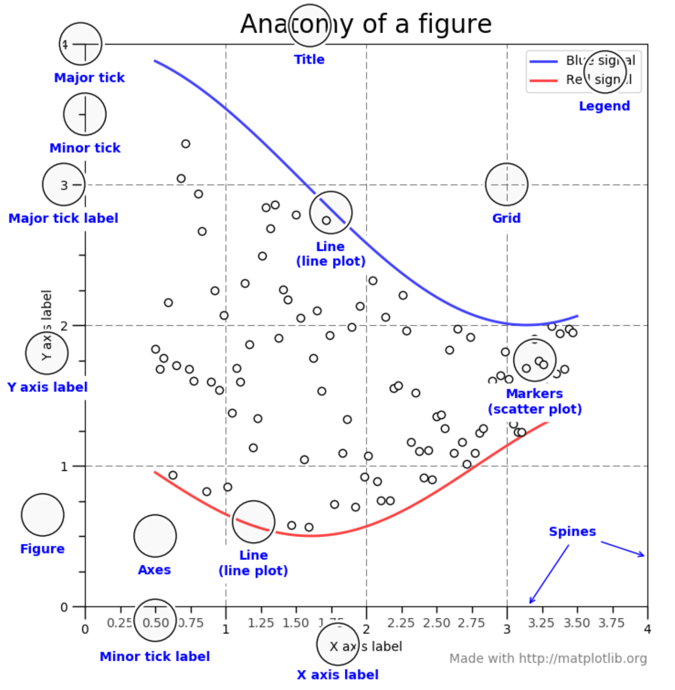

<html>
<head>
<style>
.info {
  background-color: #e6e6e6;
  border-left: 6px solid #666666;
  padding: 10px;
}
.exercise {
  background-color: #e7f3fe;
  border-left: 6px solid #2196F3;
  padding: 10px;
}
</style>
</head>
<body>

# Data Visualization

Data visualization is relevant to almost any type of data analysis project. Visuals can help you to explore the data and present results intuitively. Although each analysis technique calls for its own unique plots and other figures, generating them in Python usually requires several similar steps. In this tutorial we will deal with several plots and discuss how you can customize them to your specific needs.

In this tutorial we will use the well known ```matplotlib``` library.

## 1. A Simple Line Graph

When using ```matplotlib``` to create plots in Python, you will first need to create a figure with axes using ```pyplot.subplots```. Then, you can use ```.plot()``` to plot data in the graph.

Consider the example below, were we plot a line graph based on four data points. We use ```plt.show()``` to open the generated plot in a viewer. You can export the graph as a .png image from this viewer.

```python
import matplotlib.pyplot as plt

# Specify x and y values.
values_x = [1,2,3,4]
values_y = [0,5,10,15]

# Create the figure with axes.
fig, axes = plt.subplots()

# Plot the data.
axes.plot(values_x, values_y)

# Show the resulting graph.
plt.show()
```

****
#### Exercise 1: Simple Line Graph
<div class="exercise">

Plot a line graph shaped like an 'M' using matplotlib.

</div>
<br/>

****

## 2. Two Approaches for Plotting


[Source of image](https://matplotlib.org/tutorials/introductory/usage.html#sphx-glr-tutorials-introductory-usage-py)

The image above provides a useful overview of common elements among plots. As you can see, the gridlines on the axes are referred to as 'ticks' (minor and major). Other than that, these elements should be familiar to you.

Plotting using ```matplotlib``` can be done in two ways: object-oriented and pyplot-based. We will discuss each of these approaches briefly below.

### 2.1 Object-Oriented

The object-oriented approach concerns the explicit creation of figures and axis before plotting the data or performing any other kind of operation. This is the approach that we took in the first example. That is, we first created the figure and axes using ```fig, axes = plt.subplots()``` and then plotted the data using ```axes.plot(values_x, values_y)```.

In addition to the x and y coordinates, we can provide a label as an argument to ```axes.plot```. In this way, we can identify different data series.

```python
import matplotlib.pyplot as plt

# Specify x and y values.
values_x = [1,2,3,4]
values_y = [0,5,10,15]

# Create the figure with axes.
fig, axes = plt.subplots()

# Plot the data.
axes.plot(values_x, values_y, label='linear')

# Show the resulting graph.
plt.show()
```

Other than the ```plot()``` function, there are several methods that we can call on the figure we created. For example we can add labels and a title using the methods below. Each of these take *strings* as arguments! In our example, these methods are called on ```axes```.
* ```.set_xlabel()``` / ```.set_ylabel()``` : Add a label to the x or y axis.
* ```.set_title()``` : Add a title to the plot.
* ```.legend()``` : Add a legend to the plot.

****
#### Exercise 2: Title, Labels and Legend
<div class="exercise">

* Add a title to the plot you made in the previous exercise.
* Label the axes of the plot.
* Add a label to the M-formed line.
* Add another line to the graph which resembles a V. Also label this second data-series.
* Add a legend to the plot which shows the labels and corresponding color.

</div>
<br/>

****

### 2.2 Pyplot-Approach

The Pyplot approach lets ```pyplot``` generate and manage the figure and axes automatically. Generally, this approach is considered more suitable for interactive plots. However, it can produce the same results.

For example, the script below generates the same graph as our earlier example. Furthermore, we can use similar methods to customize the title and labels. In the example below, these methods have to be called on ```plt```.
* ```.xlabel()``` / ```ylabel()``` : Add a label to the x or y axis.
* ```.title()``` : Add a title to the plot.
* ```.legend()``` : Add a legend to the plot.

```python
import matplotlib.pyplot as plt

# Specify x and y values.
values_x = [1,2,3,4]
values_y = [0,5,10,15]

# Plot the data.
plt.plot(values_x, values_y)

# Show the resulting graph.
plt.show()
```

****
#### Exercise 3: Pyplot-Approach
<div class="exercise">

Repeat the steps in Exercise 1 and 2 using the pyplot-approach. (Note that the methods have slightly different names!)

</div>
<br/>

****

## 3. Histograms

Histograms can be useful to get a feel of your data. They are therefore often using during the data exploration phase of a study.

Let us create a list of random values that approaches a normal distribution using ```numpy``` and visualize the distribution in a histogram.
* Add ```numpy``` to the import section. (If you have not installed ```numpy``` already, please do so.)
* Create the set of 10000 random values using ```np.random.normal(size=10000)```. 
* Create a histogram using ```plt.hist()```. Provide the following arguments:
    1. The list of values.
    2. The 'density=True' setting. This normalizes the counts such that the area of the histogram (integral) sums to 1.
    3. The number of bins, which we will set to 100. (```bins=100```)

```python
import numpy as np
import matplotlib.pyplot as plt

# Specify the values.
values = np.random.normal(size=10000)

# Create a histogram with 100 bins.
plt.hist(values, density=True, bins=100)

# Show the resulting graph.
plt.show()
```

You can add a normal distribution curve to the graph using ```scipy```.
* Make sure you have ```scipy``` installed and add it to the import section (see below).
* Determine the best normal curve fit for the data using ```norm.fit()```.
* Add the this best fitting curve to the graph.

```python
import numpy as np
import matplotlib.pyplot as plt
import matplotlib.mlab as mlab
from scipy.stats import norm

# Specify the values.
values = np.random.normal(size=10000)

# Create a histogram with 100 bins.
n, bins, patches = plt.hist(values, density=True, bins=100, alpha=0.75)
plt.ylabel('Probability')
plt.xlabel('Value')

# Determine the best fitting normal curve.
(mu, sigma) = norm.fit(values)
y = ((1 / (np.sqrt(2 * np.pi) * sigma)) * np.exp(-0.5 * (1 / sigma * (bins - mu))**2))

# Plot the normal curve with a dashed line.
plt.plot(bins, y, '--')

# Show the resulting graph.
plt.show()
```


****
### Exercise 4: Histograms
<div class="exercise">

* Start by plotting a histogram using the example code above.
* Add labels to the axes and a title.
* Add a legend.
* Decrease the number of values to 100 and the number of bins to 10. What do you notice? How closely does the histogram resemble a normal distribution?
* Generate a new set of values. This time, we will specify the mean (```mu```) and the standard deviation (```sigma```) beforehand. Generate the set of values using ```mu + sigma * np.random.randn(1000)```. Check if the generated histogram indeed shows the specified mean and st. dev parameters.

</div>
<br/>

****

## 4. Scatter Plots

Developing scatterplots is another common way to explore patterns in your data. As a hypothetical example, consider two categories of buildings
1. Old buildings
2. New buildings

Now imagine that for each of these buildings, we have a score for their insulation quality ranging from 0 (extremely bad) to 1 (perfect). We would like to know if there is a pattern among old and new buildings when it comes to the quality of their insulation. We have a list of insulation scores for both old and new buildings (```old_scores``` and ```new_scores```). We specify the range of the scores ranging from 0 to 1 with a step size of 0.1 (```range_scores=[0.1, 0.2, 0.3, 0.4, 0.5, 0.6, 0.7, 0.8, 0.9, 1.0]```). Then, we use ```scatter()``` to plot both datasets. We can specify a ```color``` to distinguish the old from the new buildings. Again, we can use ```plt.legend()``` to add a legend to our figure.

```python
import matplotlib.pyplot as plt

# Specify the data and range.
old_scores = [0.30, 0.29, 0.49, 0.48, 0.10, 0.48, 0.38, 0.45, 0.20, 0.30]
new_scores = [0.89, 0.90, 0.70, 0.89, 0.10, 0.80, 0.90, 0.100, 0.80, 0.34]
range_scores=[0.1, 0.2, 0.3, 0.4, 0.5, 0.6, 0.7, 0.8, 0.9, 1.0]

# Create the figure.
plt.figure()

# Create the scatter plots.
plt.scatter(range_scores, old_scores, color='r', label='Old Buildings')
plt.scatter(range_scores, new_scores, color='b', label='New Buildings')

# Add title, labels and legend.
plt.xlabel('Insulation Score Range')
plt.ylabel('Insulation Scores')
plt.title('Scatter Plot')
plt.legend()

# Show the resulting graph.
plt.show()
```


****
### Exercise 5: Scatterplots
<div class="exercise">

* Replicate the scatterplot from the example.
* What pattern do you notice?

</div>
<br/>

****

## 5. Bar-Charts

Bar charts are a way to present categorical data. They can be useful to compare the values of a specific variable for several categories in your data. To demonstrate this, we will again use our example of insulation scores of old and new buildings. We use the ```bar()``` function from ```matplotlib``` to generate a bar chart showing the mean insulation score for both categories. We can specify several parameters for this function. For example:
* ```x``` : The x coordinates of the bars.
* ```height``` : The height of the bars. (In our case, the average insulation score for the two categories.)
* ```width``` : The width of the bars.

```python
import matplotlib.pyplot as plt
from statistics import mean

# Create the figure.
fig = plt.figure()

# Specify the raw data.
old_scores = [0.30, 0.29, 0.49, 0.48, 0.10, 0.48, 0.38, 0.45, 0.20, 0.30]
new_scores = [0.89, 0.90, 0.70, 0.89, 0.10, 0.80, 0.90, 0.100, 0.80, 0.34]

# Calculate the average insulation scores for both categories.
old_ave = mean(old_scores)
new_ave = mean(new_scores)

# Specify the data for plotting.
categories = ['Old Buildings', 'New Buildings']
scores_ave = [old_ave, new_ave]

# Specify the title and labels.
plt.title("Insulation Score Comparison")
plt.xlabel("Category")
plt.ylabel("Insulation Score")

# Create the bar chart.
plt.bar(categories, scores_ave)

# Show the resulting graph.
plt.show()
```


****
### Exercise 6: Bar-Charts
<div class="exercise">

* Replicate the bar-chart from the example.
* Are the results in line with the scatterplot?

</div>
<br/>

****

## Other Plots

* [This](https://matplotlib.org/3.2.1/tutorials/introductory/sample_plots.html) page by matplotlib provides a nice overview of other plots that can be created using their package. You can click a plot for more information.
* [This](https://www.tutorialspoint.com/matplotlib/index.htm) collection of tutorials provides some simple examples of different plots.