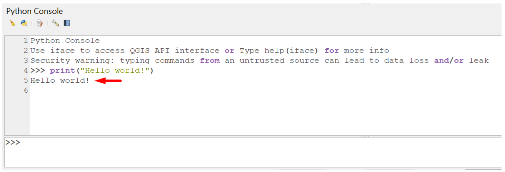
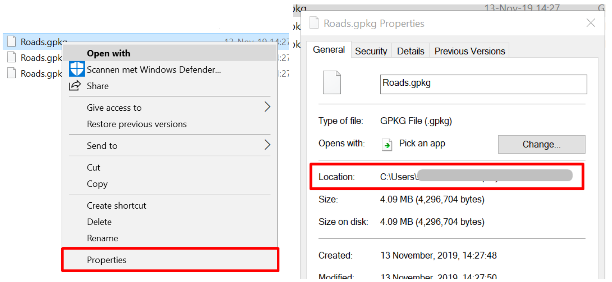
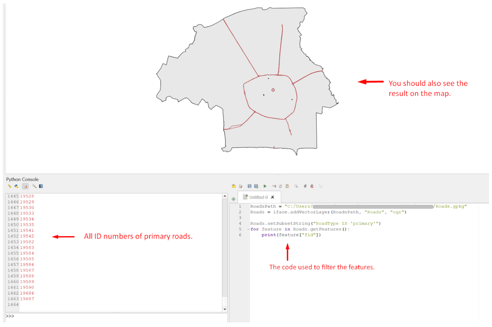
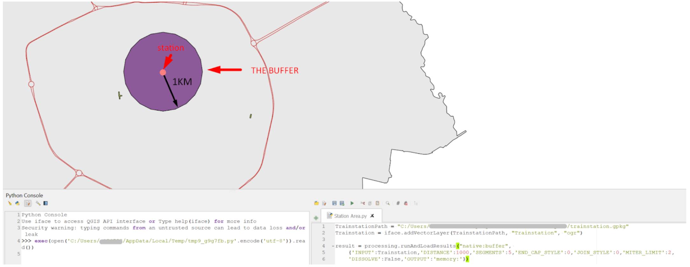
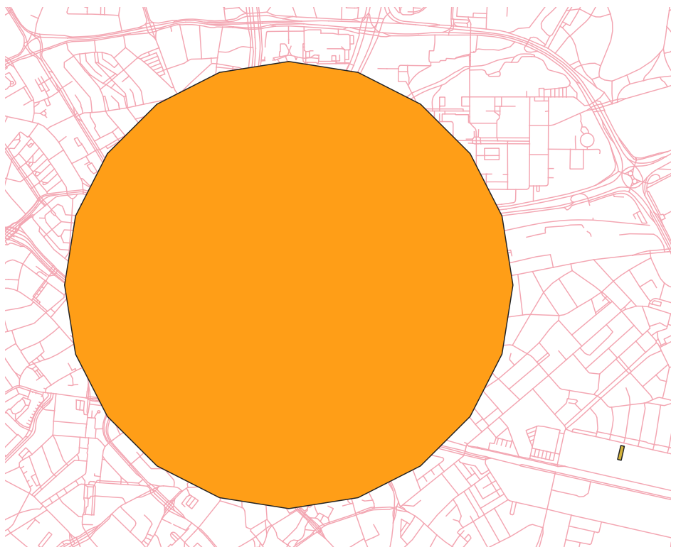
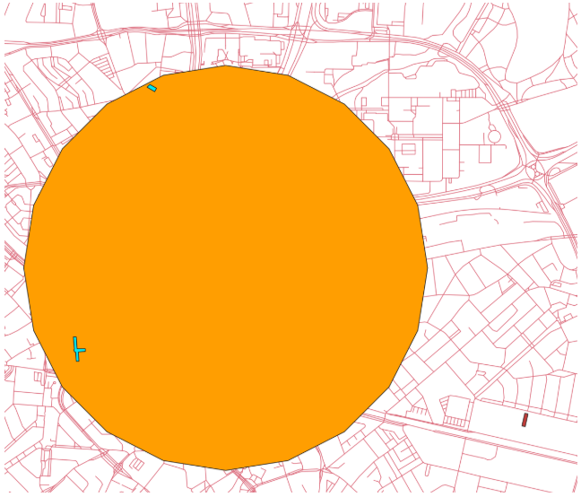
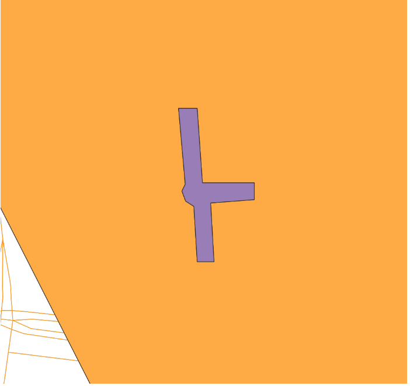

<html>
<head>
<style>
.info {
  background-color: #e6e6e6;
  border-left: 6px solid #666666;
  padding: 10px;
}
.exercise {
  background-color: #e7f3fe;
  border-left: 6px solid #2196F3;
  padding: 10px;
}
</style>
</head>
<body>

# Introduction into PyQGIS

## 1. Opening up the Python Console

This guide will demonstrate how you can use Python in QGIS to load, filter and manipulate spatial data. You will learn where to find the Python console and how to write scripts in the editor. Also, you will use the console to filter data layers for specific field values or using expressions. Further, you will find out how to access QGIS’s library of geoprocessing tools from the Python console and how to chain these tools using scripting.

You can open up the Python Console from the top menu of QGIS (Plugins > Python Console) or by pressing ```Ctrl + Alt + P```.


This console is a so-called “interactive command-line interface”, which means we can use it to access the toolbox of QGIS through lines of codes. 

When you type a line of code and press Enter, the code will be immediately executed. 

You can try this with a very simple and common example in programming tutorials: HELLO WORLD.
Try the code below to print “hello world” in the console.

```python

   print("Hello world!")
```

You just called the print function, and provided “Hello world!” (a string of text) as a parameter, providing you with an output that should like the image below.



If you want to run a set of code lines (e.g. a small script), it may be easier to use the editor. To access the editor you can click the small notepad icon in the console window (highlighted in the picture below).


When you create a script in the editor, you can conveniently save it for later use. You can run the coding in the editor window by pressing the small green play icon.

## 2. Loading a Vector Layer

Now that we know where to find the Python Console, we can start using it to load data into our project. That is, we will load a vector layer using the ``iface.addVectorLayer`` function.

You will need four layers for this exercise:

- [A point layer containing the location of the train station of Eindhoven.](https://github.com/MarjoleinHordijk/PythonTutorials/blob/master/files/04_01/Trainstation.gpkg?raw=true)
- [A polyline layer with all roads in Eindhoven.](https://github.com/MarjoleinHordijk/PythonTutorials/blob/master/files/04_01/Roads.gpkg?raw=true)
- [A polygon layer with containing buildings.](https://github.com/MarjoleinHordijk/PythonTutorials/blob/master/files/04_01/Buildings.gpkg?raw=true)
- [A polygon layer with the outline of Eindhoven.](https://github.com/MarjoleinHordijk/PythonTutorials/blob/master/files/04_01/Eindhoven.gpkg?raw=true)

Please locate the geopackage (.gpkg) files on your hard drive. You can view the location by right-clicking the file as shown below.



We can create variables to store the references to these locations. For example, if your roads.gpkg file is stored at “C:\Users\username\Desktop\Example\Roads.gpkg”, we can use the following code to store this location to the variable “RoadsPath” (but you can choose any variable name!). Please note that since we are working in Python, you have to use forward slashes!

```python
   
   RoadsPath = "C:/Users/username/Desktop/Example/Roads.gpkg"
```

Next we can do the same for the other files that we will be using.

```python

   TrainstationPath = "C:/Users/username/Desktop/Example/Trainstation.gpkg"
   BuildingsPath = "C:/Users/username/Desktop/Example/Buildings.gpkg"
   EindhovenPath = "C:/Users/username/Desktop/Example/Eindhoven.gpkg"
```

We can now use the ``iface.addVectorLayer`` function to add these layers to our project as follows.

```python

   iface.addVectorLayer(RoadsPath, "Roads", "ogr")
   iface.addVectorLayer(TrainstationPath, "Trainstation", "ogr")
   iface.addVectorLayer(BuildingsPath, "Buildings", "ogr")
   iface.addVectorLayer(EindhovenPath, "Eindhoven", "ogr")
```

You can find more details on how this function works and what parameters it takes from the documentation of QGIS (see [here](https://qgis.org/pyqgis/master/gui/QgisInterface.html#qgis.gui.QgisInterface.addVectorLayer>) ) or in [this](https://anitagraser.com/pyqgis-101-introduction-to-qgis-python-programming-for-non-programmers/pyqgis-101-loading-a-vector-layer/) tutorial. 

## 3. Viewing vector layer attributes

We can use the iface.showAttributeTable() function to access the information that is stored for each feature in our layers. For example, we can find out what type a particular road is (e.g. a highway).

To do so, we need to create a reference to the layer, as is done below.

```python

   Roads = iface.addVectorLayer(RoadsPath, "Roads", "ogr")
   Trainstation = iface.addVectorLayer(TrainstationPath, "Trainstation", "ogr")
   Buildings = iface.addVectorLayer(BuildingsPath, "Buildings", "ogr")
   Eindhoven = iface.addVectorLayer(EindhovenPath, "Eindhoven", "ogr")
```

(As you may recognize, this piece of coding is very similar to when we were loading the layers.)

We can now open the attribute table of the Roads layer using the ``iface.showAttributeTable()`` function using the following code. Note that we provide “Roads” (the name of the variable we created) as a parameter to this function.

```python

   iface.showAttributeTable(Roads)
```

However, instead of opening the attribute table (which we could have easily done through the user interface), we can also access specific information. For example, the Buildings layer contains information on the total footprint of each building in the “area” field. We can use the ``print()`` and ``field()`` functions to print these surface areas to the console. 

However, we do need to write a small **for loop** for this. This means that we will “loop” through each feature (building) in our layer, look up the value in the “area” field and print this to the console. 

```python

   for feature in Buildings.getFeatures():
       print(feature["Area"])
```

The output in your console should look something like this.


## 4. Filtering features

We can use ``.setSubsetString()`` to filter the features in one of our layers. For example, we can use this function to find all roads that are reported to be of the “primary” type in the dataset.

To filter, we first need to define an expression to provide as a parameter to ``.setSubsetString()`` . In the case of identifying the primary roads, we simply use the expression: "RoadType IS 'primary'". If we want to print the IDs of all roads that satisfy this expression, we can use the following code.

```python

   Roads.setSubsetString("RoadType IS 'primary'")
   for feature in Roads.getFeatures():
       print(feature["fid"])
```

You will see that only those roads that are reported as primary will now be visible on the map. Furthermore, you will find a list of ID numbers in your console window that correspond to the set of primary roads.



You can also use the ``.setSubsetString()`` function to filter for more than just a particular field value. For example, we can use it to identify those buildings that have a specific minimum footprint area, say 900 square meters. To do so, we use the expression: “area > 900”. If we again want to print the IDs of the features that satisfy this expression, we can use the following code.

```python

   Buildings.setSubsetString("area > 900")
   for feature in Buildings.getFeatures():
       print(feature["fid"])
```

If done correctly, you will find that two buildings have a larger footprint (IDs 1 & 3).

Alternatively, you can use the “native:extractbyexpression” algorithm. How to find and use this algorithm is discussed in a later section. This approach is more suitable if you want to create a script that chains multiple processes in a sequence. 

## 5. Finding and Using Processing Tools

We can use processing tools to analyze and manipulate our data, much like we would do if we were using the QGIS graphical interface. You can run a tool (or algorithm) using the following piece of code.

```python

   processing.run(name_of_the_algorithm, parameters)
```

You can find a list of tools that you can use by executing the following piece of code.

```python

   for alg in QgsApplication.processingRegistry().algorithms():
           print(alg.id(), "->", alg.displayName())
```

In your output, you will see on the left the provider of the algorithm and after the ‘:’ its name. For example, “gdal:aspect” is provided by GDAL and concerns the Aspect algorithm.

You can find out more information on each algorithm by using the processing.algorithmHelp() function. As parameter you should provide a reference to the algorithm you are interested from the list you generated earlier (e.g. “native:buffer”). If you do this, you will get a description of what the algorithm does, which input variables it takes and what output it provides. For example, you can check this information for the Clipping tool using the following code.

```python

   processing.algorithmHelp("native:clip")
```

You will be able to read the following from the output. “This algorithm clips a vector layer using the features of an additional polygon layer. Only the parts of the features in the Input layer that fall within the polygons of the Overlay layer will be added to the resulting layer.” Further, you will see that this algorithm takes three parameters: INPUT, OVERLAY and OUTPUT.

In the next sections we will discuss two examples of algorithms and how to execute them from the Python console.

## 6. Running a Processing tool: Buffer


You may be familiar with using geoprocessing tools in the graphical interface of QGIS. If not, you could have a look at [this](https://docs.qgis.org/3.4/en/docs/user_manual/processing/vector_menu.html) webpage for a brief overview of which tools QGIS has to offer.

In this exercise, we will use the **Buffer** tool as an example. We can use the ``processing.run()`` function to use this tool. It creates an area (polygon) around a feature so that the outline is at a fixed distance. If the feature is a point, this will mean that a circle will be created around the point with a specified radius.

We will use the **Buffer** tool to identify the area within which the train station of Eindhoven is always at a maximum of one kilometer. That is, we will create a buffer around the point that represents the station and the buffer will have a fixed distance of 1000 meters.

As you may know from creating buffers in QGIS, you are able to specify a variety of things when using this tool. That is, in addition to the distance of the buffer, we can specify things like the number of segments it will consist of or whether the result will be dissolved into a single feature. (If you do not know exactly what this means, do not worry, it is not important to this exercise!) 

When we use the buffer tool in our console, we have to provide two parameters. The first one specifies which processing tool we want to use (the buffer tool). The second parameter actually takes a dictionary as input. 

As described [here](https://anitagraser.com/pyqgis-101-introduction-to-qgis-python-programming-for-non-programmers/pyqgis-101-running-processing-tools/)
: “The dictionary has multiple items and each item consists of a key (e.g. ‘INPUT’) and a value (e.g. the uri variable). Therefore, items are often referred to as key-value pairs.”

Basically, the dictionary contains all settings that we would want to specify for the execution of the tool. We will not go into detail about every setting, but only focus on the “INPUT” and “DISTANCE” keys. The value of the “INPUT” key should be the layer that the buffers should be based on. In our case, this concerns the Trainstation layer. Recall that we stored this layer in the variable “Trainstation”. Further, the “DISTANCE” key should have been paired to the value representing the fixed distance, 1000 meters.

The dictionary that we can use to specify these settings could look like this.

```python

       {'INPUT':Trainstation,
        'DISTANCE':1000,
        'SEGMENTS':5,
        'END_CAP_STYLE':0,
        'JOIN_STYLE':0,
        'MITER_LIMIT':2,
        'DISSOLVE':False,
        'OUTPUT':'memory:'}
```

If we then provide this as a parameter to the ``processing.run()`` function, the code becomes as follows.

```python

    Buffer = processing.run("native:buffer", 
            {'INPUT':Trainstation,'DISTANCE':1000,'SEGMENTS':5,'END_CAP_STYLE':0,'JOIN_STYLE':0,'MITER_LIMIT':2,
            'DISSOLVE':False,'OUTPUT':'memory:'})
```

As you may notice, this piece of coding does not provide you with any output that is visible on the map. The reason for this is that the created buffer layer has not been loaded into our project. However, if we use ``processing.runAndLoadResults()`` instead, you should see the buffer layer appear on the canvas.

```python

    Buffer = processing.runAndLoadResults("native:buffer", 
        {'INPUT':Trainstation,'DISTANCE':1000,'SEGMENTS':5,'END_CAP_STYLE':0,'JOIN_STYLE':0,'MITER_LIMIT':2,
        'DISSOLVE':False,'OUTPUT':'memory:'})
```



Because we defined the variable “Buffer” to contain the output of the buffer algorithm, we can now refer to the outputted layer using this variable. This will be used in a later section when we will discuss how different processes can be chained.

## 7. Running a Processing tool: Extract by Attribute

As mentioned before, when you are chaining different processing tools, it is recommended to use the “Extract by Expression” algorithm for filtering your data.

Before, we filtered the Buildings layer to find out which buildings were larger than 900 square meters. We can use the “Extract by Expression” algorithm for the same purpose as shown below.

```python

    FilterBuildings = processing.runAndLoadResults("native:extractbyexpression",
        {'INPUT':Buildings, 'EXPRESSION':'area>900', 'OUTPUT':'memory:'})
```

The output will concern a layer containing only those buildings that satisfy the minimum size.

## 8. Chaining Processing Tools

We can chain processing tools so that the output of one becomes the input for the next. To do so, we need to reference the output of the first algorithm in a parameter of the second. You can reference the output of the earlier discussed buffer algorithm as follows.

```python

    Buffer = processing.runAndLoadResults("native:buffer", 
        {'INPUT':Trainstation,'DISTANCE':1500,'SEGMENTS':5,'END_CAP_STYLE':0,'JOIN_STYLE':0,'MITER_LIMIT':2,
        'DISSOLVE':False,'OUTPUT':'memory:'})
    
    BufferLayer = Buffer['OUTPUT']
```

We can then use the variable “BufferLayer” as a reference to the output layer of the buffer algorithm in a subsequent function.

Please check out the coding answer for the advanced exercise to see how this can be implemented in practice.

****
#### 9.Advanced Exercise
<div class="exercise"><strong>Now that you have had some practice with the Python console commands, you can try the exercise below which combines the functions that we have dealt with so far. The correct results for each step are provided and the utilized code is listed in the next section.</strong><br/><br/>

Please use a WGS 84 / Pseudo-Mercator projection (EPSG: 3857). You can set this at the bottom right of your QGIS window. For more information see [here](https://docs.qgis.org/3.4/en/docs/user_manual/working_with_projections/working_with_projections.html) and [here](https://docs.qgis.org/3.4/en/docs/gentle_gis_introduction/coordinate_reference_systems.html).

**Goal of exercise:** Identify which building lies within 1.5 kilometers of the train station and has a footprint of least 1000 square meters.

**1. First create a buffer around the transit station at a distance of 1.5 kilometers.**

Hint: Use the ``processing.run()`` function.

The resulting buffer should look like the one shown below.




**2. Clip the Buildings layer using the created buffer.**

Hint: You will need the "native:clip" algorithm. You can find out more about this tool using the ``processing.algorithmHelp()`` function. Just like we did with the buffer tool, we can execute this algorithm by using the ``processing.runAndLoadResults()`` function and providing it with its required parameters. Note that if you defined a variable in the previous step to contain the resulting buffer layer, you can use this variable to reference that layer.

The remaining buildings are shown here in blue. Those are the two buildings that are within 1.5 kilometers of the train station.



**3. Filter the remaining buildings for their footprint size to be at least 1000 square meters.**

Hint: Use the Extract by Attribute algorithm to find the building that satisfies the minimum size demand. 

The remaining buildings look like this. If you open the attribute table, you will be able to find the ID number of this building to be “3”.



</div>
<br/>

****


## Advanced Exercise: Answers

**1. First create a buffer around the transit station at a distance of 1.5 kilometers.**

```python

    TrainstationPath = "C:/Users/username/Desktop/Example/Trainstation.gpkg"
    BuildingsPath = "C:/Users/username/Desktop/Example/Buildings.gpkg"
    EindhovenPath = "C:/Users/username/Desktop/Example/Eindhoven.gpkg"
    RoadsPath = "C:/Users/username/Desktop/Example/Roads.gpkg"
    
    Trainstation = iface.addVectorLayer(TrainstationPath, "Trainstation", "ogr")
    Buildings = iface.addVectorLayer(BuildingsPath, "Buildings", "ogr")
    Eindhoven = iface.addVectorLayer(EindhovenPath, "Eindhoven", "ogr")
    Roads = iface.addVectorLayer(RoadsPath, "Roads", "ogr")
    
    BufferStation = processing.runAndLoadResults("native:buffer", 
        {'INPUT':Trainstation,'DISTANCE':1500,'SEGMENTS':5,'END_CAP_STYLE':0,'JOIN_STYLE':0,'MITER_LIMIT':2,
        'DISSOLVE':False,'OUTPUT':'memory:'})
    BufferLayer = BufferStation['OUTPUT']
```

**2. Clip the Buildings layer using the created buffer.**

```python

    TrainstationPath = "C:/Users/username/Desktop/Example/Trainstation.gpkg"
    BuildingsPath = "C:/Users/username/Desktop/Example/Buildings.gpkg"
    EindhovenPath = "C:/Users/username/Desktop/Example/Eindhoven.gpkg"
    RoadsPath = "C:/Users/username/Desktop/Example/Roads.gpkg"
    
    Trainstation = iface.addVectorLayer(TrainstationPath, "Trainstation", "ogr")
    Buildings = iface.addVectorLayer(BuildingsPath, "Buildings", "ogr")
    Eindhoven = iface.addVectorLayer(EindhovenPath, "Eindhoven", "ogr")
    Roads = iface.addVectorLayer(RoadsPath, "Roads", "ogr")
    
    BufferStation = processing.runAndLoadResults("native:buffer", 
        {'INPUT':Trainstation,'DISTANCE':1500,'SEGMENTS':5,'END_CAP_STYLE':0,'JOIN_STYLE':0,'MITER_LIMIT':2,
        'DISSOLVE':False,'OUTPUT':'memory:'})
    BufferLayer = BufferStation['OUTPUT']
    
    ClipBuildings = processing.runAndLoadResults("native:clip",
        {'INPUT':Buildings,'OVERLAY':BufferLayer,'OUTPUT':'memory:'})
    ClippedLayer = ClipBuildings['OUTPUT']
```

**3. Filter the remaining buildings for their footprint size to be at least 1000 square meters.**

```python

    TrainstationPath = "C:/Users/username/Desktop/Example/Trainstation.gpkg"
    BuildingsPath = "C:/Users/username/Desktop/Example/Buildings.gpkg"
    EindhovenPath = "C:/Users/username/Desktop/Example/Eindhoven.gpkg"
    RoadsPath = "C:/Users/username/Desktop/Example/Roads.gpkg"
    
    Trainstation = iface.addVectorLayer(TrainstationPath, "Trainstation", "ogr")
    Buildings = iface.addVectorLayer(BuildingsPath, "Buildings", "ogr")
    Eindhoven = iface.addVectorLayer(EindhovenPath, "Eindhoven", "ogr")
    Roads = iface.addVectorLayer(RoadsPath, "Roads", "ogr")
    
    BufferStation = processing.runAndLoadResults("native:buffer", 
        {'INPUT':Trainstation,'DISTANCE':1500,'SEGMENTS':5,'END_CAP_STYLE':0,'JOIN_STYLE':0,'MITER_LIMIT':2,
        'DISSOLVE':False,'OUTPUT':'memory:'})
    BufferLayer = BufferStation['OUTPUT']
    
    ClipBuildings = processing.runAndLoadResults("native:clip",
        {'INPUT':Buildings,'OVERLAY':BufferLayer,'OUTPUT':'memory:'})
    ClippedLayer = ClipBuildings['OUTPUT']
    
    FilterBuildings = processing.runAndLoadResults("native:extractbyexpression",
        {'INPUT':ClippedLayer, 'EXPRESSION':'area>1000', 'OUTPUT':'memory:'})
    Filtered = FilterBuildings['OUTPUT']
```


