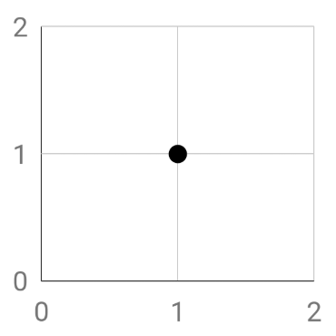
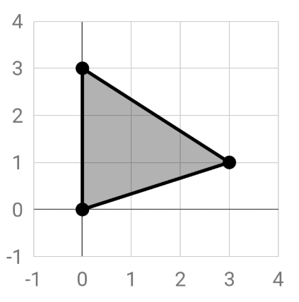
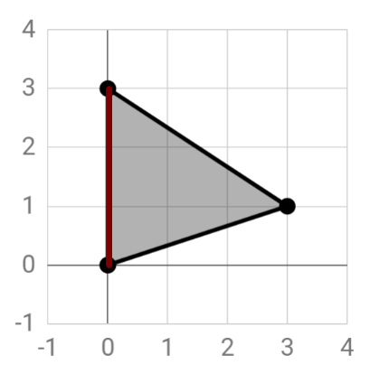
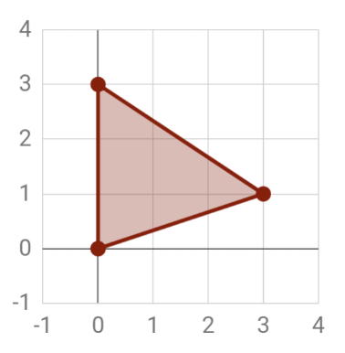
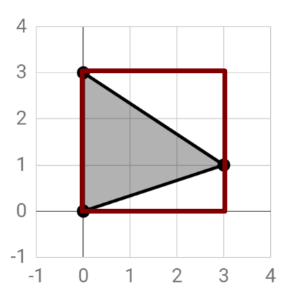
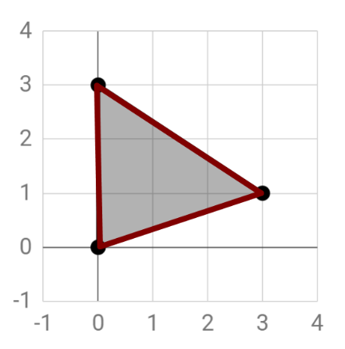

# The Shapely Module

## 1. Introduction

The Shapely Python module allows us to perform geometry operations in Python, without the need for RDBMSs (relational database management systems). That is, we do not need any software package such as QGIS or ArcGIS to perform an analysis. This is particularly useful for automation and processes that run at the server end of an application. The module is based on the well known GEOS (Geometry Engine - Open Source). 

Operation that we can perform using this module can be classified as:

1. **_Constructive operations_** (e.g. generating buffers or centroids)
2. **_Set-theoretic operations_** (e.g. intersection, union, etc.)

Note: If you use **Spyder** to run the code discussed in this tutorial, you will be able to see the resulting geometries by calling the instance. For example, if you created an instance called "Point1", you can type "Point1" in the console and hit enter to get a visual of the point.

<span style="text-decoration:underline;">What we will discuss in this tutorial:</span>

*   How to create basic geometric object instances (Point/Line/Polygon class) using Shapely.
*   How to create Polygon instances with holes.
*   How to assess attributes of these instances such as coordinates, area or the distance between two points.

<span style="text-decoration:underline;">What you will need:</span>


*   You will need to have the **_Geos_**, **_Shapely_** and **_Numpy_** modules installed. You can use <code>conda install -c anaconda geos</code></strong>, <strong><code>conda install numpy</code></strong> and <strong><code>conda install -c conda-forge geopandas</code></strong> (which includes Shapely) in your command prompt (Windows) to achieve this (assuming you have [Anaconda](https://www.anaconda.com/distribution/) installed). Do not forget to run the command prompt as administrator.

## 2. Fundamental geometric objects

Points, lines and polygons are the most fundamental geometric objects and can be used to represent the world around us in a GIS. 


*   A **_point_** is commonly defined by x and y coordinates, which describe its location on a two dimensional surface. In a three dimensional system a z coordinate is included to define the height of a point.
*   A **_line_** can be defined by a collection of interconnected points. It is bounded by two endpoints. 
*   A **_polygon_** is defined by a collection of lines that enclose an area. It is bounded by those lines that make up the outline of the geometry. Note that internal holes may exist.

Geometric objects can also be captured in a collection of multiple objects of the types listed above. 


*   A **_multipoint_** object consists of two or more points. Its geometry is captured by a list of coordinate sets that define the included points.
*   A **_multiline_** object consists of a collection of lines.
*   A **_multipolygon _**object consists of multiple polygons.


Image source: [https://automating-gis-processes.github.io/2017/lessons/L1/Geometric-Objects.html](https://automating-gis-processes.github.io/2017/lessons/L1/Geometric-Objects.html)

This tutorial was developed based on the following sources:

**[https://automating-gis-processes.github.io/2017/lessons/L1/Geometric-Objects.html](https://automating-gis-processes.github.io/2017/lessons/L1/Geometric-Objects.html)**

**[https://shapely.readthedocs.io/en/stable/manual.html](https://shapely.readthedocs.io/en/stable/manual.html)**

## 3. Create Geometric Object Instances Using Shapely

The instances of geometric objects are created based on classes, as is typical for Python. For example a **_Point_** object with coordinates (1,1) can be created as follows.


```
from shapely.geometry import Point
point = Point(1, 1)
```




A **_line_** (in Shapely called **_LineString_**) instance can be created in two ways. We can chose to first define the connected points that make up the line and use these objects to define the line geometry. Alternatively we can define the line in one go by providing the coordinates of each point in a list form.


```
from shapely.geometry import Point, LineString

# Create three points that will define the line
point1 = Point(0, 0)
point2 = Point(3, 1)
point3 = Point(0, 3)

# Create a LineString from our Point objects
line1 = LineString([point1, point2, point3])

# It is also possible to use coordinate sets to directly create a LineString object
line2 = LineString([(0, 0), (3, 1), (0, 3)])
```


**_Polygon_** instances can only be defined by a list of at least three coordinate sets as shown below.


```
from shapely.geometry import Polygon

polygon1 = Polygon([(0, 0), (3, 1), (0, 3)])
```


However, we can still use the coordinates of the points we defined earlier using a small for loop.


```
from shapely.geometry import Point, Polygon

# Create three points that will define the polygon outlines
point1 = Point(0, 0)
point2 = Point(3, 1)
point3 = Point(0, 3)

polygon2 = Polygon([[p.x, p.y] for p in [point1, point2, point3]])
```




However, it might be that we need a more complex polygon shape with interior holes. We can do so by defining the exterior outlines of the polygon and the interior hole shapes separately. 

Note that since multiple holes are possible, the variable `hole` is set up to contain a list of hole shapes. (Hence the double brackets `[[]]` .)


```
from shapely.geometry import Polygon

# First we define our exterior
exterior = Polygon([(0, 0), (3, 1), (0, 3)])

# Next we define the shape of the hole
hole = [[(0,1), (3, 1), (0, 1.5)]]

# Now a polygon can be constructed with the defined outlines and hole
polygon3 = Polygon(shell=exterior, holes=hole)
```


## 4. Assess Attributes of Geometric Objects

To perform your analysis you may be interested in particular attributes of geometric object instances. For example, you may want to find the xy coodinates of a point or the total surface area of a polygon. Below, several options are discussed to gain access to this information.

We will use the following instances in our examples. Thus, if you want to run any of the code in the subsequent sections, please make sure that you run this piece of code below first.


```
from shapely.geometry import Point, LineString, Polygon

# Define some points
point1 = Point(0, 0)
point2 = Point(3, 1)
point3 = Point(0, 3)

# Define a line
line1 = LineString([point1, point2, point3])

# Define a polygon
polygon1 = Polygon([(0, 0), (3, 1), (0, 3)])

# Define a polygon with a hole
exterior = Polygon([(0, 0), (3, 1), (0, 3)])
hole = [[(0,1), (3, 1), (0, 1.5)]]
polygon3 = Polygon(shell=exterior, holes=hole)
```

### General Attributes

You can find out of what class an instance is using <code>type()</code></strong>.


```
# Print the class of instance point 1
print(type(point1))

> shapely.geometry.point.Point

# Print the class of instance point 1
print(type(line1))

> shapely.geometry.linestring.LineString

# Print the class of instance point 1
print(type(polygon1))

> shapely.geometry.polygon.Polygon
```


* The > sign indicates output.

You can access the content of a variable that stores a Point, LineString or Polygon instance by simply printing it using <code>print()</code></strong>. In the case of a <strong><em>Point</em></strong> instance, this will provide you with the set of coordinates that defines the point. In the case of <strong><em>LineString</em></strong> or <strong><em>Polygon</em></strong> instances, the output will show the list of coordinate sets of the points that make up the line or polygon.


```
# Print the content of point1
print(point1)

> POINT (0, 0)

# Print the content of line1
print(line1)

> LINESTRING (0 0, 3 1, 0 3)

# Print the content of polygon1
print(polygon1)

> POLYGON ((0 0, 3 1, 0 3))
```


Notice that the coordinates of the polygon are shown between double brackets. The reason for this is that polygons may contain holes, as we discussed before. In that case, the coordinates of the points that capture the geometry of these holes are added to the list.


```
# Print the content of polygon3 (which contains a hole)
print(polygon3)

> POLYGON ((0 0, 3 1, 0 3), (0 1, 3 1, 0 1.5))
```


### Point Specific Attributes

You can access the x and y coordinates of a point.


```
# Get x coordinate of point2
x = point2.x

# Get y coordinate of point2
y = point2.y

# Print the coordinates
print(x)
print(y)

> 3.0
> 1.0
```


We can also extract the coordinates of a point in one go. This will provide you with two numpy arrays each containing the x and y coordinate respectively.


```
# Get x and y coordinates of point2
xy = point2.coords.xy

# Print the coordinates
print(xy)

> (array('d', [2.2]), array('d', [4.2]))
```


Also, you can determine the distance between two points using <code>.distance()</code></strong>. Please note that the unit for this distance depends on the coordinate system that u have used to define your points. If you used a UTM zone projection or for example Amersfoort / RD New, the units will be in meters. However, if you used a WGS84 projection, the distance will be in decimal degrees.


```
# Determine the distance
distance = point1.distance(point3)

# Print the distance
print(distance)

> 3.0
```




### LineString Specific Attributes

You can access the coordinates of a **_LineString_** instance similarly as with **_Point_**. Again, the output is presented as two numpy arrays. The first array contains all x coordinates, whereas the second contains all y coordinates.


```
# Get x and y coordinates of the points that make up line1
line1_xy = line1.xy

# Print the coordinates
print(line1_xy)

> (array('d', [0, 3, 0]), array('d', [0, 1, 3]))
```


You can extract the x or y coordinates using the indices. Since Python always starts counting at 0, the first array containing the x coordinates has index 0 and the second array containing the y coordinates has index 1.


```
# Get only the x coordinates of the points that make up line1
line1_x = line1.xy[0]

# Get only the y coordinates of the points that make up line1
line1_y = line1.xy[1]

# Print the coordinates
print(line1_x)
print(line1_y)

> array('d', [0, 3, 0])
> array('d', [0, 1, 3])
```


We can also determine the length of a **_LineString_** instance using <code>.length</code></strong>. 


```
# Get the lenght of line1
line1_length = line1.length

# Print the length
print(line1_length)

> 6.767828935632369
```


### Polygon Specific Attributes

You can determine the centroid of a **_Polygon_** instance using <code>.centroid</code></strong>. This will generate a <strong><em>Point</em></strong> instance which you can store in a variable (in this case �poly1_centroid�).


```
# Generate the centroid of polygon1
poly1_centroid = polygon1.centroid

# Print the centroid geometry
print(poly1_centroid)

> POINT (1 1.333333333333333)
```


Further, you can determine the area of a **_Polygon_** instance using <code>.area</code></strong>. Notice that, as with determining the length of a line, the unit of the area depends on the coordinate system that you used when creating the line.


```
# Determine the area of the polygon
poly1_area = polygon1.area

# Print the area of the polygon
print(poly1_area)

> 4.5
```




We can also determine the smallest rectangular area that a **_Polygon_** instance fits in using <code>.bounds</code></strong>. This generates a �bounding box� around the polygon.


```
# Generate the bounding box for polygon1
poly1_bounds = polygon1.bounds

# Print the centroid geometry
print(poly1_bounds)

> (0.0, 0.0, 3.0, 3.0)
```




Furthermore, we can determine the total length of the outline by using <code>.exterior</code></strong> to extract the exterior and <strong><code>.length</code></strong> to determine its length. 


```
# Extract the exterior of polygon1
poly1_exterior = polygon1.exterior

# Determine the length of the exterior
poly1_exterior_length = poly1_exterior.length

# Print the length
print(poly1_exterior_length)

> 9.76782893563237
```

